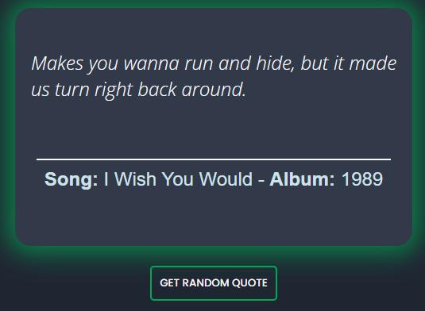

# Taylor Quote Generator


A simple web application that generates random quotes from Taylor Swift.

<div>

<div>

## Table of Contents
- [Demo](https://taylor-quotes.vercel.app/)
- [Features](#features)
- [Installation](#installation)
- [Contributing](#contributing)
- [License](https://github.com/Mo7ammedd/taylor-quote-generator/blob/main/LICENSE)

## Features
- Generates random Taylor Swift quotes.
- Responsive design for mobile and desktop.

## Installation
Install dependencies:
   Open a terminal or command prompt in the root of the project directory, and run the following command to install the required dependencies:
   ```
   npm install
   ```

5. Start the application:
   After the installation is complete, run the following command in the terminal to start the application:
   ```
   npm start
   ```

Now the application should be up and running. You can access it through your browser at the specified URL 
```(usually http://localhost:3000)```. 

## Usage
* To Get Random Taylor Swift lyrics```:https://taylor-swift-lyrics-eaia.onrender.com/get```
* To Get Random Taylor Swift lyrics from a specific album or song :
  * From an album : ```https://taylorswiftapi.onrender.com/get?album=<album>```
  * From a song : ```https://taylorswiftapi.onrender.com/get?song=<song>```
* To Get All Taylor Swift lyrics from a specific album or song :
  * From an album : ```https://taylorswiftapi.onrender.com/get-all?song=<song>```
  * From a song : ```https://taylorswiftapi.onrender.com/get-all?album=<album>```

## Contributing
  * visit my repo to Contributing with my API  [click here](https://github.com/Mo7ammedd/taylor-swift)
  * Contribute your favourite taylor lyrics / quotes
  * Add the lyrics / quotes to `taylorquotes.js`
  * While adding a quote, keep album and song fields as none
  * make a pull request
  * no repetitions
  * adding endpoints / making other suggestions
    


## License

[](http://badges.mit-license.org)

- MIT License
- Copyright 2024 © 
- [Mohammed Mostafa](https://github.com/mo7ammedd)
- [Yousef hassany](https://github.com/youssefhassany)
